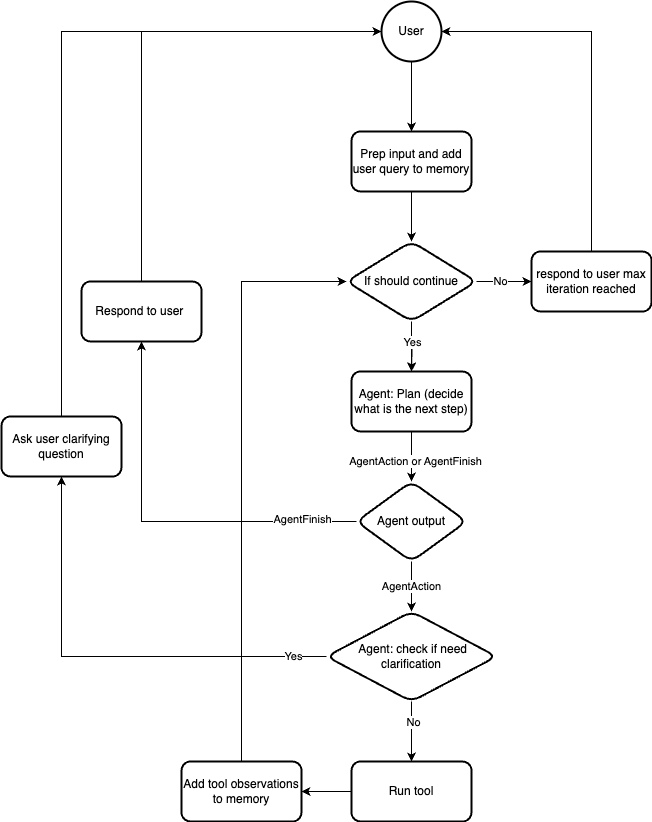

# MiniChain
Large language models (LLMs) have shown huge success in different text generation tasks and
enable developers to build autonomous agent based on natural language objectives.  
However, most of the agents require heavy customization for a specific purpose, and existing 
tools are sometimes overwhelming to be adapted for different use cases. As the result, it is 
still very challenging to customize on top of existing agents.

In addition, evaluating such autonomous agent powered by LLMs is a very manual and
expensive task by trying different use cases under different potential user scenarios.

Minichain took the inspirations from LangChain and AutoGPT and aims to solve 
both problems by providing a light weighted and extensible framework
for developers to build their own conversational agent using LLMs with custom tools and 
automatically evaluates different user scenarios using simulated conversations.

### Features

- 🚀 light weighted and extensible conversational pipeline
- 🔗 agent that can run different custom tools
- 💾 tracking conversation history and tools outputs memory
- 🤖 automated agent evaluation with simulated conversations


## Setup
After cloning the repo
```shell
cd minichain
pyenv virtualenv 3.10.11 venv
pyenv local venv

pip install -r requirements.txt

export OPENAI_API_KEY=
export PYTHONPATH=`pwd`
```

Run your first conversation with agent interactively
```shell
python minichain/workflows_evaluation/order_status_request_test.py -i
```

## Components overview
There are a few key components in Minichain, which could be easily extended to build new agents.

### Chain
Chain is the overall orchestrator for agent interaction. It determines when to use tools or respond to users.
Agent provides ways of interaction, while Chain determines how to
interact with agent.

Flow diagram describes the high level picture of the default chain interaction with an agent.



### Agent
Agent is the component that decide how to respond to user or whether agent requires to use tools.  
There are a few typical interactions an agent should support:

**prompt** Depending on agents you are building, you might want to wrirte different agent's 
planning prompt. policy controls the steps agent should take for different situation.
Those prompt could be string template so that later one the same agent could substitute 
different values into the prompt for different use cases

**should_answer**: not all the question should be answered by agent. If agent decides that this
is not a query that should be handled by this agent, it could gracefully exits as early as
possible.

**plan**: This is the core of the agent which takes in all the stored memory, including past
conversation history and tool output, named `observations`, and prompt the model to output 
either `AgentFinish` or`AgentAction`.  
`AgentFinish` means agent decide to respond back to user with a
message. While not just `plan` could output `AgentFinish`, `AgentFinish` is the **only** way to
exits the chain and wait for next user inputs.  
`AgentAction` means agent decide to use a tool and wants to perform an action before responding
to user. Once chain observe agent would like to perform an action, it will calls the
corresponding tool and store tool outputs, named `observations`, into the chain's memory for
future interactions. At this point, there is no message respond back to user.

**clarify_args_for_agent_action**
When agent wants to take an action with tools, it usually requires to have some input arguments,
which may or may not exists in the past conversation history or observations. While the
smartest agent would output `AgentFinish` with response that asks user for missing information.
It might not always be the case. To decouple the problem and make is simpler for agent, we
could add another step that explicitly ask user for clarifying questions when any argument is
missing for a given tool to be used. This function will either outputs an `AgentFinish`, which
asks the clarifying question or `AgentAction` that is same as action just checked, which means
no more clarifying question is needed.

### Memory
It is important for chain to keep the memory for a particular conversation with user. Memory
interface expose two ways to save memories. One is `save_conversation` which saves the chat
history between agent and user, and `save_memory` to save any additional information such as
`observations` as key value pairs.  
Conversations are saved/updated before chain responds to user, and `observations` are saved
after running tools. All memorized contents are usually provided to Agent for planning
the next step.

## Workflow Evaluation
It is usually very hard to evaluate the quality of autonomous agent because there are so many
ways an user could ask agent questions and different contexts user might, which alters the
desired outcome from the conversation. For this purpose, we introduced the workflow evaluation
which simulate the conversation between autonomous agent and simulated users with LLM under
different user context.  
Simulate user will have varied conversations with autonomous agent under different situations,
another LLM would determine if the conversation reaches the desired outcome. Human could also
inspect the conversation history and action taken by agent at the end of the test to evaluate
the quality of the autonomous agent.  
There are a couple key concepts to build such test cases

**tools** Since most of the agent would need to use tools, you would also need to provide the
required tools with their name, function callable, and tool description. The better your tool
name and description are, higher the chain agent would use the right tool with right arguments.

**test_cases** Define different user scenarios. Each test case would have 4 different components.
1. test_name: this is a descriptive name for later human evaluation to quickly know which test
   agent struggled with
2. user_query: this is the starting question user would ask the agent for
3. user_context: different user might have different context information, which causes them to
   respond differently for the same question. simulated user will try to respond to user
   question using the context it has here
4. expected_outcome: describe the expected outcome of this conversation between user and agent.
   LLM in the end would determine if the conversation reached the desired outcome for simpler
   inspection.

### How to run workflow tests
There are two modes for running workflow tests. Interactively or running all test cases.
For example in `minichain/workflows_evaluation/refund_request_test.py`, it has already defined 
a few test cases. 
Running all the test cases defined in the test
```shell
python minichain/workflows_evaluation/order_status_request_test.py
```

You can also interactively having a conversation with that agent by passing the interactive 
flag `-i`
```shell
python minichain/workflows_evaluation/order_status_request_test.py -i
```

All of the test results will be saved to `./test_results` directory by default in jsonl format.
Each test case results would look like the following
```json
{
    "test_name": "change shipping address",
    "conversation_history":
    [
        "user: can i change my shipping address?",
        "assistant: May I have your order ID please?",
        "user: My order ID is 456 and I would like to change my shipping address to 234 Spear St, San Francisco",
        "assistant: The current status of your order is 'not_shipped' and the tracking URL is example.com/456. Would you like to proceed with changing the shipping address?",
        "user: Yes, please update my shipping address to 234 Spear St, San Francisco",
        "assistant: Your shipping address has been updated to 234 Spear St, San Francisco. Is there anything else I can assist you with?"
    ],
    "is_agent_helpful":
    [
        true,
        "Yes, the conversation reaches the expected outcome for the user as the assistant confirms the order status and successfully updates the shipping address as requested by the user"
    ],
    "actions_took":
    [
        {
            "tool": "check order status",
            "tool_input":
            {
                "order_id": "456"
            },
            "observation":
            {
                "status_code": 200,
                "order_id": "456",
                "order_status": "not_shipped",
                "tracking_url": "example.com/456",
                "shipping_address": "301 ivy street san francisco ca"
            }
        },
        {
            "tool": "change shipping address",
            "tool_input":
            {
                "order_id": "456",
                "new_address": "234 Spear St, San Francisco"
            },
            "observation":
            {
                "status_code": 200,
                "order_id": "456",
                "shipping_address": "234 Spear St, San Francisco"
            }
        }
    ],
    "num_turns": 6,
    "expected_outcome": "found order status and changed shipping address"
}
```