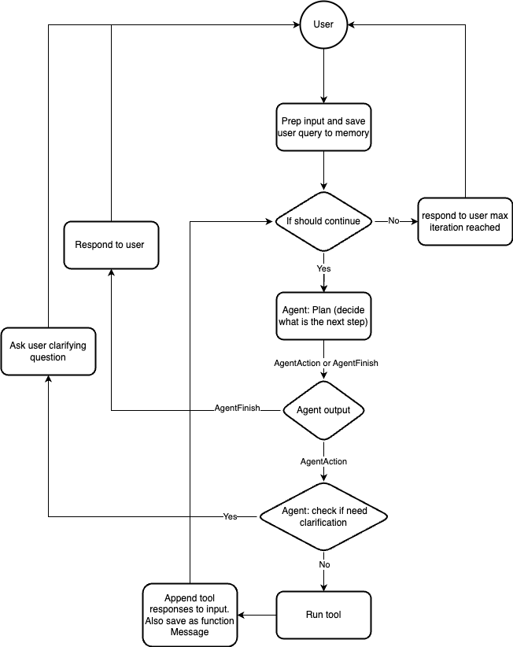

# Chain

If you have worked on LangChain before, you already knows 80% of what chain does.
Chain is the stateful orchestrator for agent, which controls when to involve agent in which way. It
offers a framework to interact with agents by controlling the information flow. Chain leverages a
memory component that memorizes past conversations and any other intermediate
steps, such as tool outputs.

For a typical chain, it contains an `agent` to interact with, list of `tools` that agent might use
and `memory` that stored stateful information.

Flow diagram describes the high level picture of the default chain interaction with an agent.

## Differences with LangChain

To remove abstraction and internal concepts, we expose a more flatten and simplified interface
for chain and explained in details below.
The main difference is we simply the flow and removed as many internal concepts as possible.

## BaseChain and Chain

This is the most generic interface for implementing any chain in AutoChain. It contains a few
features user could override. `BaseChain` is the generic interface where `Chain` is the default
chain implementation by implementing the only abstract method `take_next_step`

### run

this is the entry point to interact with chain with `user_query`. Because there are often
different ways to interact with the chain, any chain could override the `_run` function that
handles the business logics for agent interaction, while still be benefited from input and
output standardization provided by the `BaseChain`.

### _run

This provide the standard way to manage memories and determines when the agent should stop
answering user query. Most of the time, user could reuse how
we manage memory and just need to change what is the next step agent should do given inputs
including `user_query` and memories. In that case, user would need to implement the
`take_next_step` function.

### take_next_step

This is an abstract method implements the way you would like to interact with agent and asking
agent to come up with the next step. The default implementation is in `Chain`, where it asks
the `agent` to plan for next step and execute `tools` selected by `agent`

### should_answer

It is often unclear when agent should stop responding to user query. Sometimes user would just
say "Thank you" in the end but agent might not understand this as end of the conversation, so
it could still try to respond with more contents, even clarifying questions in some cases. By
default, agent will always respond to user until user stops. In the case that is not desired, we
introduce the `should_answer` step in `BaseChain` to stop agent from further interaction.
